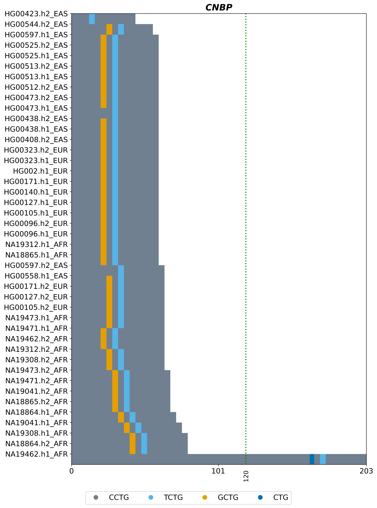

# TRMotifAnnotator

## Overview

TRMotifAnnotator is a command-line tool designed for the identification and annotation of motifs in tandem repeats. The tool detects both **canonical** and **non-canonical** repeat motifs, including those resulting from **substitutions** or **insertion/deletion (indel) events**. The output includes a **TSV file** with detailed annotations of repeat genotypes and motif structures, along with a **sequence composition plot** highlighting canonical and non-canonical motifs.

## Features

- **Motif Annotation**  
  Detects and annotates canonical repeat motifs in user-provided sequences.

- **Non-Canonical Motif Detection**  
  Identifies repeat interruptions caused by substitutions, insertions, or deletions—capturing motif diversity within repeat tracts.

- **Detailed TSV Output**  
  Generates a tab-delimited `.tsv` file with:
  - Sample ID and sequence length  
  - Repeat copy number and canonical motif  
  - Sorted non-canonical motifs (by order of appearance)  
  - Detailed repeat structure  
  - Counts of canonical and non-canonical motifs  
  - Percentage of non-canonical bases  
  - Classification of non-canonical motifs by length (same as or different from canonical)

- **Motif Composition Plots**  
  Produces motif-colored plots visualizing sequence composition across samples.

- **Custom Threshold and Motif Highlighting**  
  Supports user-defined thresholds and vertical reference lines, along with optional specification of non-canonical motifs for visualization.


## Installation

### Dependencies

TRMotifAnnotator requires the following:

- Python 3.6+
- NumPy
- Matplotlib

Install dependencies using:

```bash
pip install numpy matplotlib
```

### Cloning the Repository

To install TRMotifAnnotator, clone the GitHub repository:

```bash
git clone https://github.com/wf-TRs/TRMotifAnnotator.git
cd TRMotifAnnotator
```

## Usage

Run the script with the following command:

```bash
python TRMotifAnnotator.py --input <sequence.fa> --output <prefix> --canonical-motif <motif> --max-mers <motif_length> --vlines "[(value1, 'color1'), (value2, 'color2')]" --locus <locus-name>
```

### Arguments

`--input <sequence.fa>`: Input FASTA file containing repeat sequences.

`--output <prefix>`: Prefix for output files.

`--canonical-motif <motif>`: Canonical repeat motif.

`--max-mers <motif_length>`: Canonical motif length (e.g., 5 if the motif is AAAAG).

`--vlines "[(value1, 'color1'), (value2, 'color2')]"`: Optional user-defined vertical lines to highlight thresholds for allelic classification.  
⚠️ **Note:** Each `value` must be an integer within the range of the sequence length (i.e., between 0 and the maximum sequence length in your dataset).

`--locus <locus-name>`: Name of the locus being analyzed; will be displayed as the plot title.

`--num-nc-motifs <Non-canonical_motif-number>`: Number of non-canonical motifs to be displayed; by default, up to 10 motifs will be shown.


### Example Command

```bash
python TRMotifAnnotator.py --input CNBP.fasta --output CNBP_sequence_composition --canonical-motif CCTG --max-mers 4 --vlines "[(120, 'green)]" --locus CNBP
```

## Output

**###1. TSV File:** Contains detailed motif annotations and structural information.

### Example TSV Output

| Sample ID       | Sequence Length | Repeat Copy | Canonical Motif | Sorted Non-Canonical Motifs | Repeat Structure                              | Canonical Motif Count | Non-Canonical Motif Count | % Non-Canonical Base | Non-Canonical Same Length | Non-Canonical Different Length |
|-----------------|------------------|--------------|------------------|------------------------------|------------------------------------------------|------------------------|----------------------------|------------------------|-----------------------------|-------------------------------|
| NA18864.h1_AFR  | 72               | 18           | CCTG             | GCTG, TCTG                   | (CCTG)8-GCTG-CCTG-TCTG-(CCTG)7                 | 16                     | 2                          | 11.11                  | 2                           | 0                             |
| NA18864.h2_AFR  | 80               | 20           | CCTG             | GCTG, TCTG                   | (CCTG)10-GCTG-CCTG-TCTG-(CCTG)7                | 18                     | 2                          | 10.00                  | 2                           | 0                             |
| NA18865.h1_AFR  | 60               | 15           | CCTG             | GCTG, TCTG                   | (CCTG)5-GCTG-CCTG-TCTG-(CCTG)7                 | 13                     | 2                          | 13.33                  | 2                           | 0                             |
| NA18865.h2_AFR  | 68               | 17           | CCTG             | GCTG, TCTG                   | (CCTG)7-GCTG-CCTG-TCTG-(CCTG)7                 | 15                     | 2                          | 11.76                  | 2                           | 0                             |

**Description of the TSV Output Columns:**

`sequence_length`: Sequence length (in base pairs)

`repeat_copy_number`: Number of repeat copies in the sequence

`canonical_motif`: The canonical repeat motif sequence

`non_canonical_motifs`: Non-canonical motifs found, listed in the order they appear within the repeat tract

`repeat_structure`: Detailed description of the repeat structure combining canonical and non-canonical motifs

`count_canonical`: Counts of canonical motifs within the sequence

`count_non_canonical`: Counts of non-canonical motifs within the sequence

`percent_non_canonical_bases`: Percentage of bases in the sequence that are from non-canonical motifs

`count_nc_same_length`: Counts of non-canonical motifs with the same length as the canonical motif

`count_nc_diff_length`: Counts of non-canonical motifs with lengths different from the canonical motif  

**###2. Sequence Composition Plot:**

Graphical representation of repeat motifs in the provided examples/CNBP.fasta sequence

## Citation

If you use TRMotifAnnotator in your research, please cite:

> Indhu Shree Rajan Babu, Readman Chiu et al. Population-Level Characterization of Disease-Associated Tandem Repeat Loci in Long-Read Diploid Assemblies: Integrating Genotype, Sequence, Phylogenetic, and Local Ancestry Analyses, and Linkage Disequilibrium Structure.

## Contact

For issues or contributions, open a GitHub issue or contact: Indhu Shree Rajan Babu - [indhu.babu@bcchr.ca](mailto\:indhu.babu@bcchr.ca)
